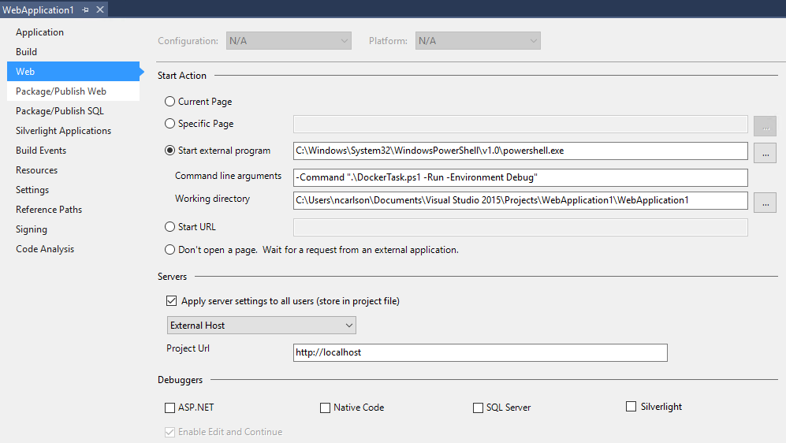

This is an example MVC app with added scripting to create a docker image and container for hosting it on Windows 2016 Server Core.

Build should work out of the box, but to get Ctrl+F5 to start the container you will need to customize the debug settings of the project. They should look something like:

- Start External Program: C:\Windows\System32\WindowsPowerShell\v1.0\powershell.exe
- Command line arguments: -Command ".\DockerTask.ps1 -Run -Environment Debug"
- Working directory: &lt;project folder&gt;
